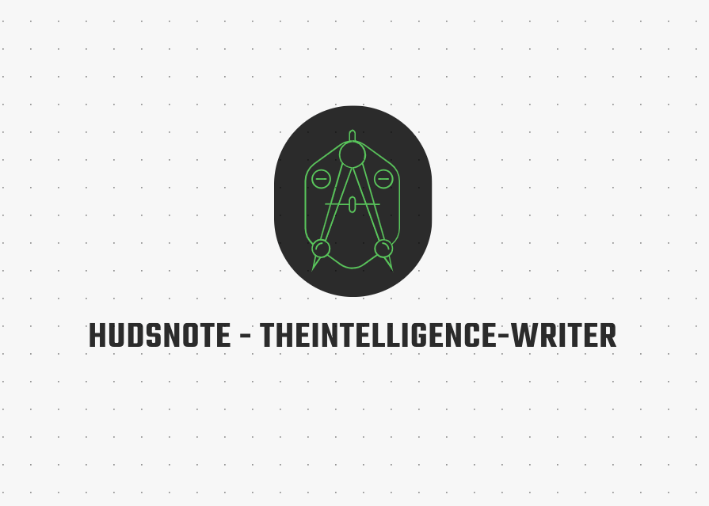

# Documentation for `hudsnote` Tool



## Table of Contents

1. [Overview](#overview)
2. [Usefulness](#usefulness)
   - [Key Benefits](#key-benefits)
   - [Application](#application)
     - [Threat Intelligence](#threat-intelligence)
     - [Other Uses Cases](#other-uses-Cases)
3. [Usage](#usage)
   - [Command-Line Arguments](#command-line-arguments)
   - [Running the Tool](#running-the-tool)
4. [User Guide](#user-guide)
   - [Preparing the Source Input File](#preparing-the-source-input-file)
   - [Running the Tool](#running-the-tool-1)
   - [Data Entry Process](#data-entry-process)
     - [Starting Data Entry](#starting-data-entry)
     - [Entering Data](#entering-data)
     - [Special Commands During Data Entry](#special-commands-during-data-entry)
     - [Handling Mandatory Fields](#handling-mandatory-fields)
     - [Confirming Data Entry](#confirming-data-entry)
   - [Saving Data](#saving-data)
   - [Validating Output File](#validating-output-file)
   - [Self-Deletion](#self-deletion)
5. [Additional Notes](#additional-notes)
6. [Potential Improvements](#potential-improvements)

## Overview

The `hudsnote` tool is designed to streamline data entry through a command-line interface (CLI), facilitating the collection of structured data by reading questions or fields stored in a file and presenting them to a user. The tool is especially useful in the context of threat intelligence gathering and investigation, as it ensures consistency in the data collection process. The collected data is formatted into JSON, which can then be easily converted to STIX, CSV, or other formats suitable for integration into a Cyber Threat Intelligence (CTI) repository.

## Usefulness

### Key Benefits

1. **Consistency:** Ensures that all necessary fields are completed uniformly, reducing the chances of missing critical information.
2. **Efficiency:** Speeds up the data collection process by automating the presentation of questions and the recording of responses.
3. **Integration:** Outputs data in JSON format, which can be easily converted to other formats such as STIX or CSV, and subsequently integrated into CTI repositories for further analysis and action.

### Application

#### Threat Intelligence

When investigating cybersecurity incidents, having a structured and consistent method for collecting data is crucial. The `hudsnote` tool allows analysts to gather detailed information about incidents, such as alert names, timestamps, user details, and other relevant fields. This structured data can then be analyzed, correlated with other data sources, and used to build a comprehensive threat landscape.

#### Other Uses Cases

Apart from threat intelligence, the `hudsnote` tool can be utilized in various other cybersecurity domains:

1. **Incident Response:**
   - During an incident response, the tool can be used to collect detailed information about the incident, such as the timeline of events, affected systems, user actions, and remediation steps. This ensures a consistent and thorough documentation process, which is crucial for post-incident analysis and reporting.

2. **Vulnerability Management:**
   - The tool can be used to gather information about vulnerabilities in the system, including details about affected assets, vulnerability descriptions, severity levels, and remediation efforts. This data can then be used to prioritize and address vulnerabilities systematically.

3. **Compliance Audits:**
   - During compliance audits, the tool can be used to collect evidence and documentation required for various regulatory standards (e.g., GDPR, HIPAA, PCI-DSS). It ensures that all necessary fields are captured consistently, facilitating easier compliance reporting.

4. **Security Assessments:**
   - The tool can assist in conducting security assessments by collecting data on security controls, configurations, and practices within an organization. This helps in identifying gaps and recommending improvements to strengthen the security posture.

5. **Training and Awareness:**
   - The tool can be used to create questionnaires for training and awareness programs. By collecting responses from employees, it can help gauge the effectiveness of the training and identify areas where additional focus is needed.

Once collected, the JSON data can be converted into STIX (Structured Threat Information Expression) format, a standardized language for representing threat intelligence information. Alternatively, the data can be exported as CSV for use in spreadsheets or other tools. This flexibility ensures that the collected intelligence can be used effectively in various CTI workflows.

## Usage

### Command-Line Arguments

The tool accepts the following command-line arguments:

- `-s, --source_input_file`: Specify a source input file name or path (required).
- `-fd, --field_delimiter`: Specify field delimiter (default: `_`).
- `-d, --destination_output_file`: Specify a destination output file name or path (optional).
- `-V, --validate_destination_output_file`: Validate destination output file name or path.
- `-c, --create_new_qb_file`: Create a new question book `.qb` file.
- `-R, --readme`: Short notes on how to use the tool.
- `-D, --delete_file_after_run`: Delete the file after execution.
- `-N, --ntp_server`: Specify an NTP server for configuration (default: `1.asia.pool.ntp.org`).
- `-L, --license_token`: Supply license token from author.
- `-S, --make_destination_file_static`: Make the destination file static.

### Running the Tool

To run the tool, use the following command:

```bash
.\hudsnote.exe -s <source_input_file>
```

For example:

```bash
.\hudsnote.exe -s questions.qb -d output.json -N 0.pool.ntp.org -L <license_token>
```

## User Guide

### Preparing the Source Input File

Create a source input file (e.g., `questions.qb`) containing the fields or questions you want to collect answers for. The format should follow these guidelines:

- **Comments:** Lines starting with `#` are comments and will be ignored.
- **Mandatory Fields:** Lines starting with `###` are mandatory fields and must be completed by the user. Ensure all mandatory fields are on one line, separated by commas.
- **Optional Fields:** Other lines are considered optional fields.

#### Example:

```plaintext
# These fields are required and must be completed
### alert name, alert id, timestamp, user name, host name, source ip, source domain, revision status

# Data source: Endgame(EDR)
#-------------------------------------------------------
alert name
alert id
alert timestamp
alert revision status
user name
host name
source ip
source domain
destination ip
destination domain
source process name
source process path
target process name
target process path
target process path hash
process command line args
processes in process tree
file name
file hash
file path
file source
registry keys
other information1
other information2
other information3
analysis
conclusion
```

### Running the Tool

To start the data entry process, run the tool with the required arguments. For example:

```bash
.\hudsnote.exe -s questions.qb
```

### Data Entry Process

#### Starting Data Entry

- After starting the tool, you will be prompted to type `yes` to begin data entry or `exit` to terminate the tool.

#### Entering Data

- For each field, you will be prompted to provide an answer.
- Hit the `[ENTER]` key once to move to the next field/question when the field/question is empty.
- Hit the `[ENTER]` key twice to move to the next field/question when the field/question is not empty.

#### Special Commands During Data Entry

- `=back`: Move back to the previous field/question. Confirm by hitting the `[Enter]` key twice.
- `=clear`: Clear the screen.
- `=save`: Save the current content mid-way. At the end of the input process, a prompt will request you to confirm saving.
- `=usage`: Display the help menu.

#### Handling Mandatory Fields

- If you encounter a mandatory field (starting with `###`), the tool will force you to provide input before proceeding.

#### Confirming Data Entry

- After completing the data entry, the tool will display the collected data and ask for confirmation to save it.

### Saving Data

At the end of the data entry process, the tool will prompt you to confirm if the collected data inputs are valid. Type `yes` to save the data to the specified output file or `no` to exit without saving.

### Validating Output File

If the `-V` or `--validate_destination_output_file` argument is provided, the tool will validate the JSON content in the specified output file. This is useful to ensure that the output data is properly formatted and free from errors.

### Self-Deletion

If the `-D` or `--delete_file_after_run` argument is provided, the tool will delete itself after execution. This can be useful for maintaining security or cleaning up after the tool has run.

## Additional Notes

- **Source Input File:** Ensure the source input file contains valid fields or questions.
- **Mandatory Fields:** Mandatory fields should be marked with `###` and be on a single line, separated by commas.
- **Special Commands:** The tool supports various commands during data entry (`=back`, `=clear`, `=save`, and `=usage`) to help navigate and manage the process.
- **Licensing:** Make sure to provide the correct license token if required.

For further assistance or inquiries, please contact the developer.

## Potential Improvements

While the `hudsnote` tool is highly effective

, there are several ways it could be enhanced:

1. **Graphical User Interface (GUI):** Developing a GUI version could make the tool more user-friendly, especially for non-technical users.
2. **Automated Data Validation:** Implementing more robust data validation checks to ensure data integrity before saving.
3. **Database Integration:** Adding direct integration with databases like MongoDB or Elasticsearch to save data in real-time.
4. **Enhanced Error Handling:** Improving error messages and handling to provide more informative feedback to the user.
5. **Configuration Files:** Allowing users to specify configuration settings in a separate file to simplify command-line usage.
6. **Export Formats:** Providing additional export options, such as direct conversion to STIX or CSV within the tool.
7. **Multi-Language Support:** Adding support for multiple languages to make the tool accessible to a broader audience.
8. **Templates:** Including predefined templates for common data collection tasks to streamline setup for new users.
9. **Integration with CTI Platforms:** Developing plugins or connectors for popular CTI platforms to facilitate seamless data transfer.
